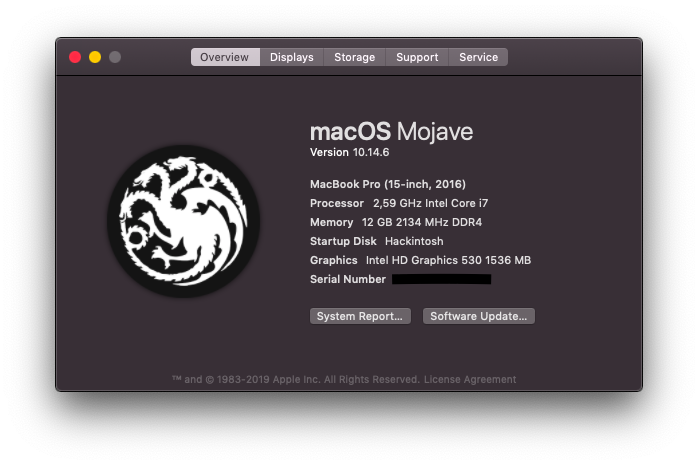
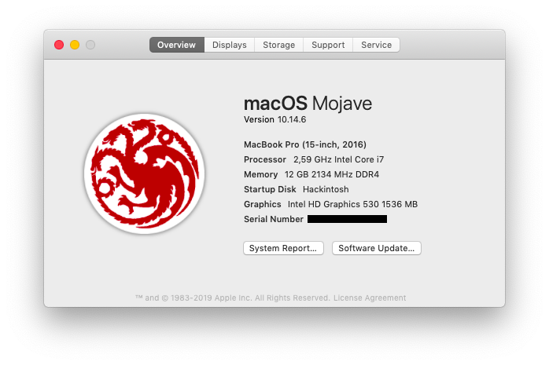
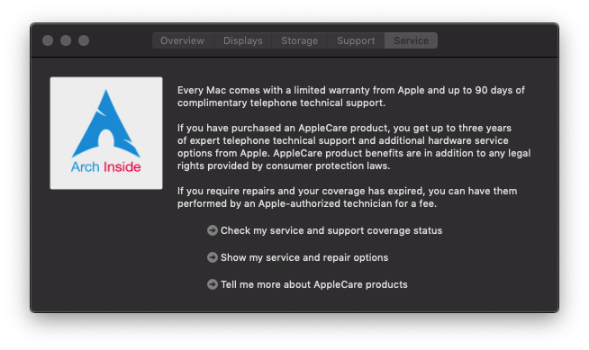

#An Edited `Assets.car` for Hackintosh

# Overview

###Dark mode example

### Light mode example

### Service logo

# Guide to install

1. Open Finder
2. Browse to Applications → Utilities → System Information
3. Right-Click on System Information, select `Show Package Content`
4. Browse into Contents → Resources
5. Backup your exist `Assets.car` in case you get problem.
6. Replace yours with new `Assets.car`
7. Enter security password.
8. Have Fun!

# FAQ

? : How to add my own image?

! : Install `ThemeManager`, and open your `Assets.car` with it. Cheers.